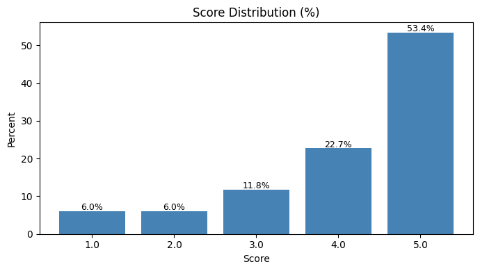
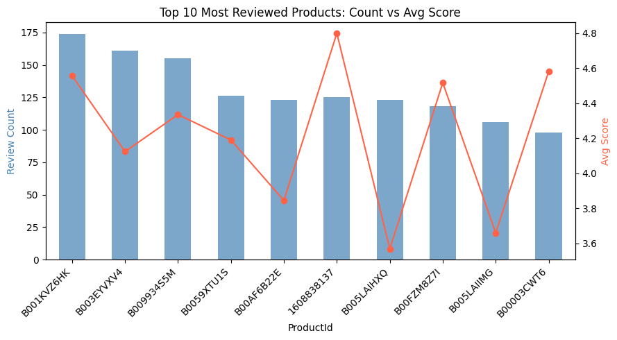
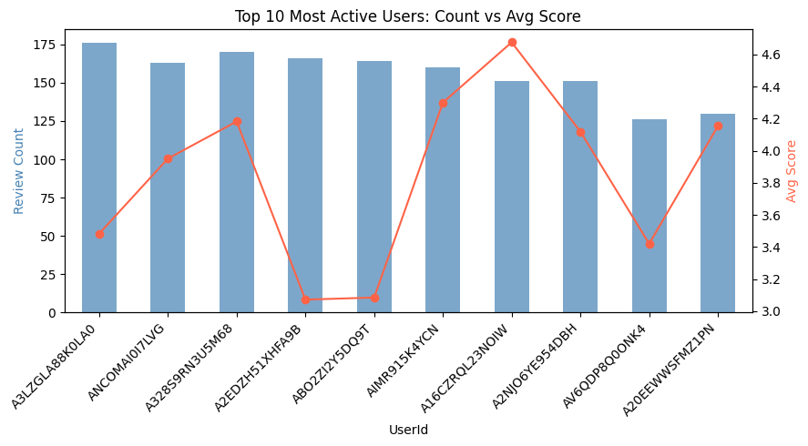
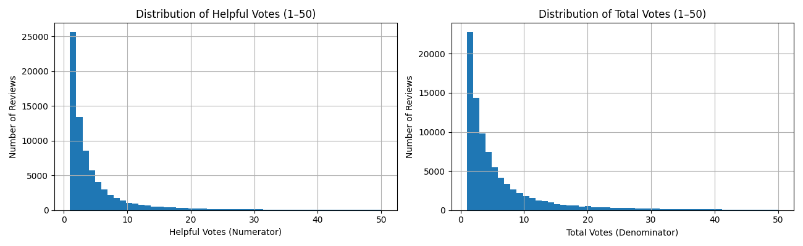
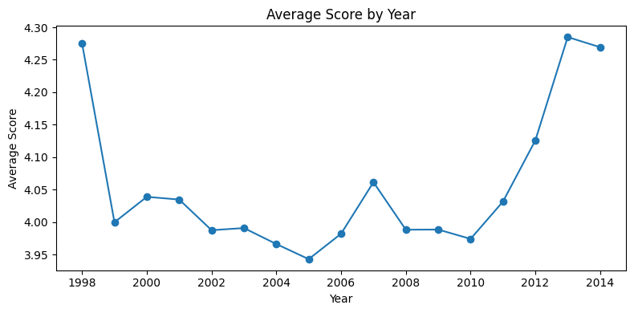
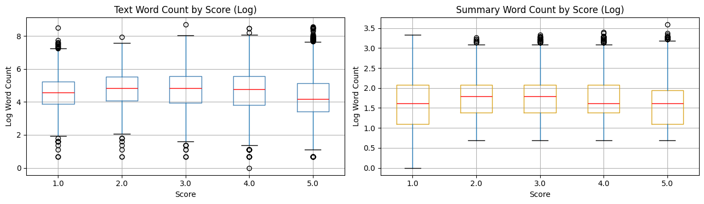
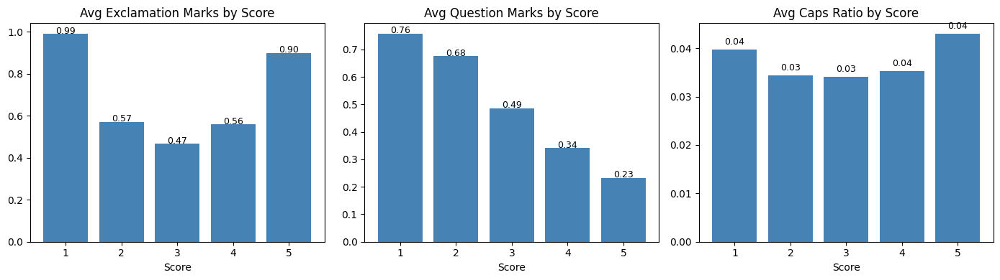
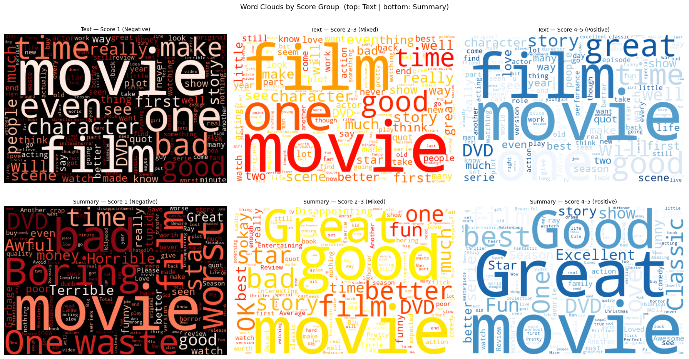

[](https://classroom.github.com/a/6KpniKiX)
# CS506 Midterm - Amazon Movie Star Rating Prediction

## RUN THE CODE
```
git clone https://github.com/CS506-Boston-University/midterm-99Niki-1.git
python -m venv venv
source venv/bin/activate  

# Install packages
pip install pandas numpy matplotlib seaborn scikit-learn scipy wordcloud
```

## Introduction
This project is to predict user's star ratings  as accurately as possible based on their Amazon Movie Reviews using the related features.
The dataset includes categorical IDs (user, product), numerical helpfulness votes, a Unix timestamp, a short summary, and the full review text. 

In the rest of this notebook, I’m going to utilize these features on the prediction of the star rating score. This project, if this works well, it opens up some interesting possibilities. For movies that haven't collected enough ratings yet, a model like this could give a rough sense of how audiences feel about them: which could feed nicely into a recommendation system down the line. More details about the competition can be found at the link below.


## Exploratory Data Analysis (EDA)
The training dataset contains 9 columns in total. “Id” is simply identifier of each record row, so it's excluded from modeling. The remaining features fall into three groups: ProductId and UserId are categorical identifiers; HelpfulnessNumerator, HelpfulnessDenominator, and Time are numerical; and Summary and Text are free text fields that require natural language processing before they can be used in a model. Each group needs a different preprocessing approach, which will be covered in the Data Processing section. Next I’m going to take an in-depth look into them one by one.

### Missing Value 
| Column | Missing Values |
|---|---:|
| Id | 0 |
| ProductId | 0 |
| UserId | 0 |
| HelpfulnessNumerator | 0 |
| HelpfulnessDenominator | 0 |
| Time | 0 |
| Summary | 1 |
| Text | 1 |
| Score | 13976 |

From summary, we can find most empty values exist in the column Score. This is normal because score is the output and the training/testing set are mixed together. The two missing text entries can be safely imputed with empty strings or dropped without meaningfully affecting the dataset.

### Socre (Target)



The score distribution is heavily skewed toward the positive end, 5.0 alone make up 53.4%, and 4-star reviews add another 22.7%. Over three quarters of all labeled reviews are in the top two categories. Scores of 1 and 2 each account for only 6%, making them significantly underrepresented.

### User and product frequency 




Both user activity and product popularity follow a long-tail distribution, with a small group of power reviewers and highly-reviewed products driving a disproportionate share of the dataset. Among the top 10 most active users, average scores range from ~3 to ~4.6, and similarly ~3 to ~4 across top products, meaning who is reviewing and what is being reviewed matters far more than how often. With 65,269 unique users and 34,026 unique products, raw IDs are too high cardinality to use directly, so the meaningful signal to extract is each user's and product's historical average score via target encoding, with review count added as a reliability indicator.


### HelpfulnessNumerator & HelpfulnessDenominator


Nearly half the reviews (45.8%) have zero helpful votes, meaning the helpfulness ratio is undefined for a large portion of the dataset. .The raw numerator and denominator are both strongly right-skewed with a long tail out to 4,500+. 

Three preprocessing decisions followed from this:
- Log-transform both numerator and denominator to compress the extreme tail.
- Add a 'has_votes' binary flag to distinguish reviews with no votes (where ratio is meaningless) from those with votes (where ratio carries real signal).
- ows where the numerator exceeded the denominator were treated as data corruption and removed.An impossible value that would inject noise into any ratio-based feature


### TimeStamp
Time can capture the changes of user behavior over years.


The average score over time tells: it stayed fairly stable in the 4.0 range throughout the 2000s, dipped slightly around 2005, then jumped noticeably in 2012–2013 alongside the volume surge. This uptick during high volume years could reflect a shift in reviewer demographics or platform behavior.

### Summary & Text (KEY!!!)
#### I. Review Length


Review length shows a weak but visible pattern across scores: negative reviews (Score 1) have a slightly lower median log word count than scores 2–3, while score 5 is notably the shortest, consistent with the idea that satisfied reviewers leave quicker notes while dissatisfied or mixed ones write more. However, the overlap across all groups is large and the boxes are wide, meaning length alone is a weak standalone predictor. Both Text and Summary follow the same trend, though Summary is far more compressed (log scale 0–3.5 vs 0–8 for Text), confirming the two fields behave differently and are worth encoding separately. In data processing, log1p(word count) for both Text and Summary should be included as numeric features rather than raw counts.
#### II.Review Length


Punctuation patterns show a clear U-shaped relationship with score — exclamation marks peak at Score 1 (0.99) and Score 5 (0.90), dipping in the middle, reflecting emotional intensity at both extremes: frustration for low scores and enthusiasm for high ones. Question marks decline steadily from Score 1 (0.76) to Score 5 (0.23), suggesting negative reviewers are more likely to express disbelief or rhetorical frustration. Caps ratio is flat across scores (0.03–0.04) and carries minimal signal. These stylistic patterns — especially punctuation — are invisible to word-level TF-IDF but are naturally captured by character n-gram TF-IDF, which is the direct justification for including it in data processing.
#### III.Summary & Text Content — Word Clouds


Looking at the word clouds, several highfrequency words( film, movie, one, time, character, watch, DVD, story, people) appear at large scale across all three score groups, meaning they carry zero discriminative power and should be added to the custom stop word list to free up TF-IDF feature budget for words that actually matter.

The Summary row is noticeably cleaner than the Text row. Score 1 summaries concentrate tightly around worst, waste, boring, horrible, while Score 4–5 summaries cluster (great, classic, excellent, love)very little overlap. This suggests Summary TF-IDF deserves a larger max_features budget than Text, since each word it contributes carries more signal per token.

Two assumptions for later:

- bigrams likely matter more in Text than Summary, since Text contains multi-word phrases like "waste of time" or "bad acting" that lose meaning when split into unigrams, while Summary is already distilled into single adjectives. 
- And given how heavily the mixed group's vocabulary overlaps with both extremes, 

## Data Processing
Empty Text and Summary fields were filled with blank strings rather than dropped, since removing them would discard the associated numeric signals such as helpfulness votes and user history. Helpfulness nulls were filled with zero, reflecting that no votes were recorded rather than data being truly missing, and rows where the helpful vote count exceeded the total vote count were removed as these represent impossible values indicative of data corruption. Finally, duplicate rows sharing the same UserId, ProductId, and Text were dropped to prevent the same review from inflating user and product average score calculations during feature engineering.

### Train/validation/test split: 
The labeled rows (Score is not null) were split 80/20 into training and validation sets using stratified sampling on the integer score. Stratification ensures the class imbalance is preserved in both splits, so the validation RMSE is representative of the true distribution.


## Feature Processing

| Feature Group | Feature(s) | Motivation |
|---|---|---|
| **Review Length** | `log_text_words`, `log_summary_words`, char counts | Negative reviews longer; 5-star shortest — log smooths outliers |
| **Writing Style** | `exclamation_count`, `question_count`, `uppercase_ratio`, `digit_ratio` | U-shaped punctuation vs score; char n-grams capture this natively |
| **Helpfulness** | `helpfulness_ratio`, `log_help_num`, `log_help_den`, `has_votes` | Only 64% of reviews are voted on; ratio unreliable without vote guard |
| **Timestamp** | `year`, `month`, `dayofweek` | Avg score jumped in 2012–13 volume surge; captures platform drift |
| **User/Product Frequency** | `user_review_count_log`, `product_review_count_log` | Power-law distribution; log compresses extreme reviewers |
| **Target Encoding (LOO)** | `user_avg_score`, `product_avg_score` | Strongest numeric signal; LOO on train prevents target leakage |
| **Word TF-IDF** | Combined text+summary, unigrams+bigrams, 120k features | Captures sentiment lexicon: `'waste'`/`'boring'` vs `'great'`/`'classic'` |
| **Char TF-IDF** | `char_wb` 3–5-grams, 60k features | Captures misspellings, punctuation style, emotional fragments |
| **Summary TF-IDF** | Summary only, unigrams+bigrams, 25k features | Summary is opinion distilled; higher signal density per word |

### I. Target Encoding with Leave-One-Out
user_avg_score and product_avg_score are the strongest numeric predictors. Naive mean encoding leaks the target — a row's own score is included in its own average. LOO fixes this by excluding each row's score when computing its group mean during training. The clearest failure case: a single-review user would otherwise have user_avg_score equal to their exact score — perfect leaked information.

### II. Features Tried and Removed

user_score_std / product_score_std — No RMSE improvement; std adds noise for users with few reviews while the mean already captures most of the signal.
Naive mean encoding — Tested before LOO; marginally worse RMSE confirmed the fix was meaningful.
Train-only retraining — Early submissions retrained on 80% only. Final version merges train and validation before retraining, recovering the full labeled dataset.


### III. TF-IDF Design
Three separate matrices rather than one. Text and Summary are concatenated with a [SEP] token for the word vectorizer. Word TF-IDF (120k features) captures the sentiment lexicon; a custom stop word list removes 25 domain-noise terms (film, movie, watch, etc.) identified from the word clouds. Char TF-IDF (60k features) captures punctuation bursts and misspellings invisible to word-level models — no stop words here since punctuation must stay intact. Summary TF-IDF (25k features) gives the high-signal summary field dedicated weight with min_df=2 since meaningful sentiment words appear less frequently in short summaries. All three use sublinear_tf=True, replacing raw TF with 1 + log(TF) to prevent long reviews from dominating by repetition.

## Model Select and Compare
I chose four models covering different algorithmic families to compare their performance on this regression task:

- KNN (k=5): predicts score by averaging the 5 most similar reviews in TF-IDF space
- Linear Regression (unregularized OLS); assigns a direct weight to every feature in the vocabulary
- Ridge Regression (alpha=5) with L2-regularized regression: shrinks coefficients to handle the high-dimensional sparse matrix; alpha selected from grid search over [0.5, 1.0, 2.0, 5.0, 10.0]
- Logistic Regression (C=1.0) treats score as 5-class classification: final prediction computed as sum(prob × class) to produce a continuous output for RMSE; C selected from grid search over [0.1, 0.5, 1.0, 2.0, 5.0]

All predictions are clipped to [1.0, 5.0] to respect the valid score range. Results on the validation set:
| Model| RMSE |
|---|---|
| KNN (k=5)| 1.0428 |
| Linear Regression| 1.0118 |
| Logistic Regression(C=1.0)| **0.6599** |
| Ridge (alpha=5)| 0.7076 |


**Logistic Regression has the best predictor.** KNN degrades in high dimensional sparse space. Linear Regression overfits when feature count exceeds row count. Ridge improves significantly with L2 regularization, but Logistic Regression outperforms all others by treating score as a 5 class problem and computing the probability weighted expected value, it captures the ordinal structure of scores more effectively than direct regression while still producing a continuous output for RMSE.

## Discussion

Working through this project, the structured features turned out to be much harder to get right than expected. The user and product bias features (user_avg_score, product_avg_score) were the most frustrating bottleneck. The intuition is solid, but 65k unique users means the majority appear only once or twice, making their historical averages statistically unreliable. LOO encoding fixed the leakage problem, but there is no clean fix for sparsity. A single review user's average is just their one score, which tells the model almost nothing generalizable.

Three things I tried made results worse. 
- **Adding score standard deviation** (user_score_std, product_score_std) to capture how polarizing a reviewer is seemed reasonable on paper, but in practice it hurt RMSE; std is undefined for single review users and noisy for anyone with fewer than five reviews, which is most of the dataset. 
- **Applying SVD (Truncated SVD / LSA) after TF-IDF** . The intuition was that dimensionality reduction would denoise the sparse feature matrix and surface latent topics, but in practice it discarded exactly the rare but discriminative word-level signals that linear models like Ridge rely on most. TF-IDF sparse features work well precisely because each dimension is interpretable and meaningful; compressing them into a dense lower-dimensional space throws that away. 
- **Expanding the stop word list and handle bigrams** . The word clouds clearly showed that film, movie, and character appear equally across all score groups, so removing them felt obvious. But aggressively pruning the vocabulary shifted the TF-IDF distribution in ways that hurt more than they helped. Even semantically neutral words contribute to document length normalization that the model relies on internally, so their removal quietly broke the weighting the model depended on.

A debugging mistake also shaped the final result. Logistic Regression was evaluated using predict instead of predict_proba, hiding its true performance, after fixing that, it became the best model at RMSE 0.6599.

The biggest lesson I took from this project was that the text carries almost everything. Every attempt to squeeze more signal out of the structured metadata hit a wall, while each improvement to the TF-IDF setup produced a cleaner RMSE gain. And also understanding exactly what a model outputs matters as much as the model choice, a misaligned evaluation can completely hide true performance.